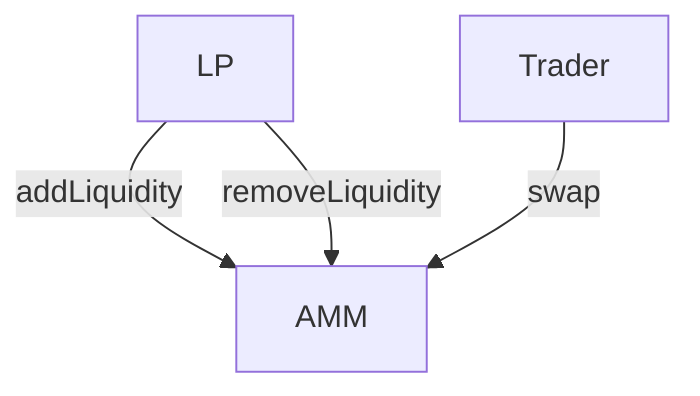

# AMM Architecture

## Structure
- `AMM.sol`: Main contract containing token reserves and math.
- pre-calculates reserves and maintains constant product pricing model.

## Execution Flow

```mermaid
graph TD
  LP -->|addLiquidity| AMM
  Trader -->|swap| AMM
  LP -->|removeLiquidity| AMM
```
