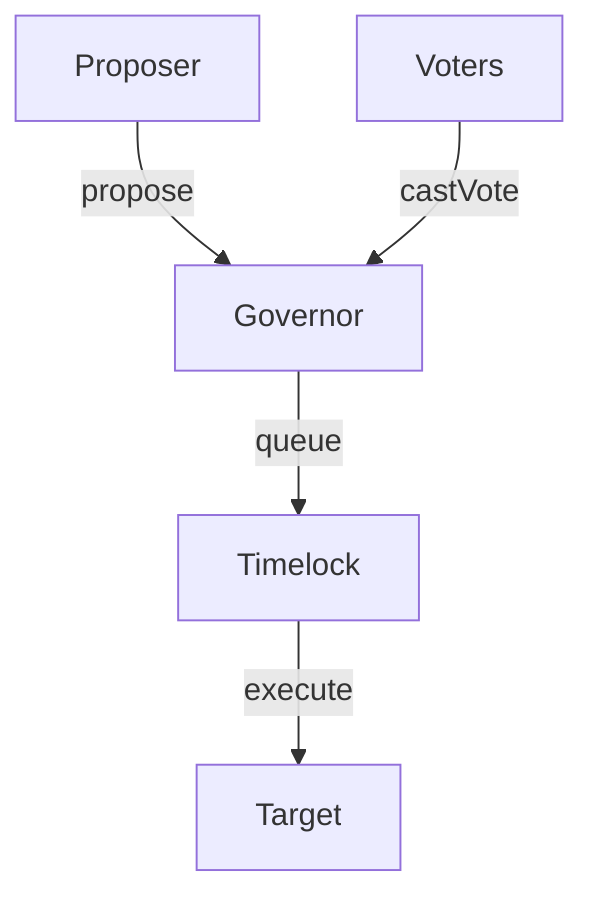

# DAO Architecture

## Structure
- `GovernanceToken.sol`: ERC20Votes token for tracking voting power checkpoints.
- `GovernorContract.sol`: Main Governor core handling proposal lifecycle.
- `TimeLock.sol`: Timelock controller enforcing delays before executing approved proposals.

## Execution Flow

