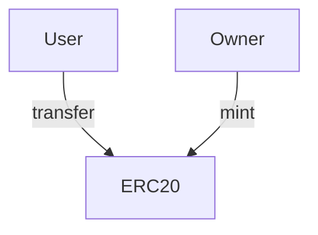

# ERC20 Token Architecture

## Structure
- `ForgeToken.sol`: Main contract extending OpenZeppelin's ERC20.
- Uses ownership rules (`onlyOwner`) to regulate minting capabilities.

## Execution Flow

