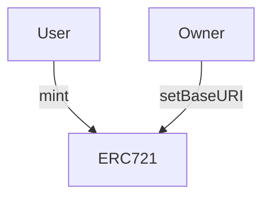

# ERC721 NFT Architecture

## Structure
- `ForgeNFT.sol`: Main contract extending OpenZeppelin's ERC721URIStorage.
- Base URI configuration.

## Execution Flow

```mermaid
graph TD
  User -->|mint| ERC721
  Owner -->|setBaseURI| ERC721
```
