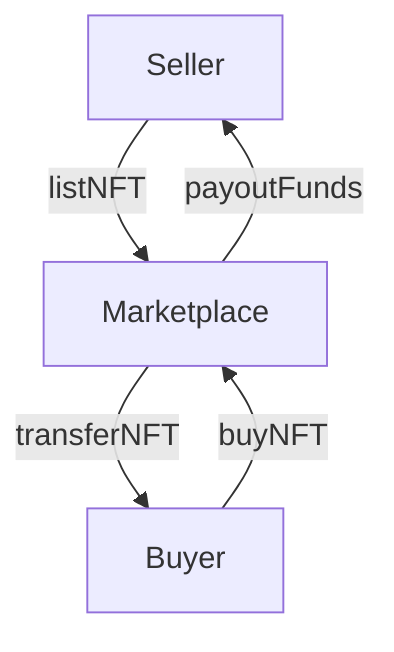

# NFT Marketplace Architecture

## Structure
- `NFTMarketplace.sol`: Main contract containing listing indices and bid details.
- Uses `IERC721` transfer callbacks.

## Execution Flow

```mermaid
graph TD
  Seller -->|listNFT| Marketplace
  Buyer -->|buyNFT| Marketplace
  Marketplace -->|transferNFT| Buyer
  Marketplace -->|payoutFunds| Seller
```
