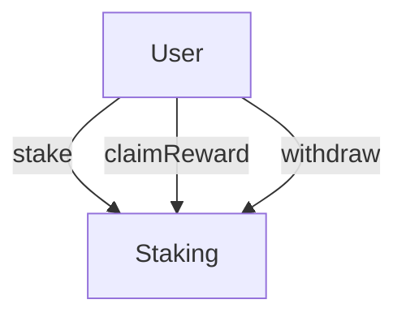

# Staking Architecture

## Structure
- `SimpleStaking.sol`: Main contract holding staked balances and executing reward emissions.
- Reward accumulation tracking per share.

## Execution Flow

```mermaid
graph TD
  User -->|stake| Staking
  User -->|claimReward| Staking
  User -->|withdraw| Staking
```
